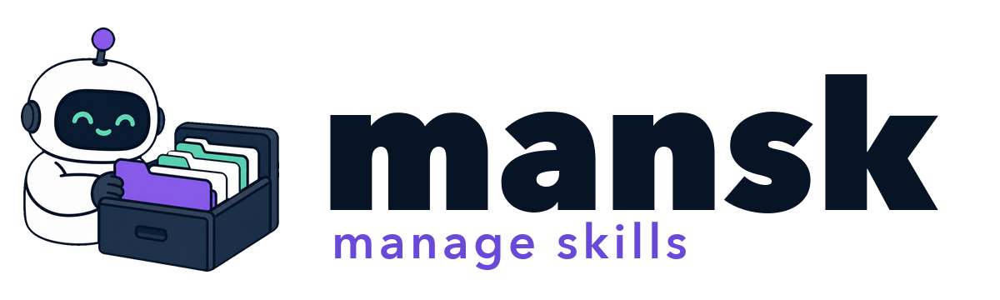

<p align="center">
  
</p>

Mansk is a small, reproducible manager for agent skills. Declare your local and
Git-based skills once, then install them wherever your coding agents expect to
find them.

## Why?

I wanted a sane way to manage the skills I use across different agents considering
remote and local skills throughout my development machines.

Mansk tries to tackle that by using a single TOML manifest that specifies that desired
state and manages things from there.

## Install

```sh
git clone https://github.com/fsmiamoto/mansk.git
cd mansk
cargo install --path .
```

## Get started

Discover and install skills from a GitHub repo, folder, or `SKILL.md` link:

```sh
mansk get fsmiamoto/skills
mansk get fsmiamoto/skills --all # Install all discovered skills
```

Alternatively, declare your skills manually. Create `~/.config/mansk/skills.toml`:

```toml
schema = 1
default-targets = ["claude", "pi"]

[targets]
# Relative target paths are resolved from your home directory.
claude = ".claude/skills"
pi = ".pi/agent/skills"
custom = "/absolute/path/to/skills"

# Install every direct child containing a SKILL.md file.
[[collections]]
source = "https://github.com/example/all-skills.git"
selector = "main"
root = "skills" # optional; defaults to the repository root

# Install one skill from a Git repository.
[[skills]]
source = "https://github.com/example/skills.git"
selector = "v2" # branch, tag, or commit
path = "skills/review"
targets = ["claude"] # optional; replaces default-targets

# Install a local skill. Its path is relative to this manifest.
[[skills]]
path = "../local-skill"
```

Then resolve and install everything:

```sh
mansk update
```

Mansk shows the planned changes and asks before applying them. It writes a
`skills.lock` beside the manifest; commit that file if you want to reproduce the
same setup elsewhere.

Every skill directory must contain a `SKILL.md`. Its directory name becomes the
installed skill name, and duplicate names are rejected.

## Commands

```sh
mansk get owner/repo  # discover, select, save, and install GitHub skills
mansk update          # resolve selectors, update the lock, and install
mansk sync            # install exactly what the current lock records
mansk update --dry-run
mansk sync --dry-run  # preview without changing target directories
mansk update --yes    # apply without asking for confirmation
mansk update --verbose # include revisions, collection changes, and full paths
```

Output groups changes by skill, with the affected agents on each row:

```text
mansk update

  Update  review     claude, pi
  Add     prototype  claude, pi
  Remove  old-tool   pi

3 skills changing · 18 unchanged
Apply changes? [y/N]
```

The default manifest follows `XDG_CONFIG_HOME` when set. To use another file,
pass `--manifest PATH` before or after the command:

```sh
mansk --manifest ./skills.toml update
```

## How it works

```text
skills.toml                skills.lock
(branches, tags, paths)       (exact commits)
      │                           │
      └────── mansk update ──────┘
                                  │
                           mansk sync
                                  │
                         ~/.cache/mansk
                                  │
                         target symlinks
```

`update` resolves branches and tags to exact commits and rewrites the lock.
`sync` uses those recorded commits without advancing them. Downloaded content is
kept under `~/.cache/mansk` (or `XDG_CACHE_HOME`) and can be safely deleted; the
next sync rebuilds it.
